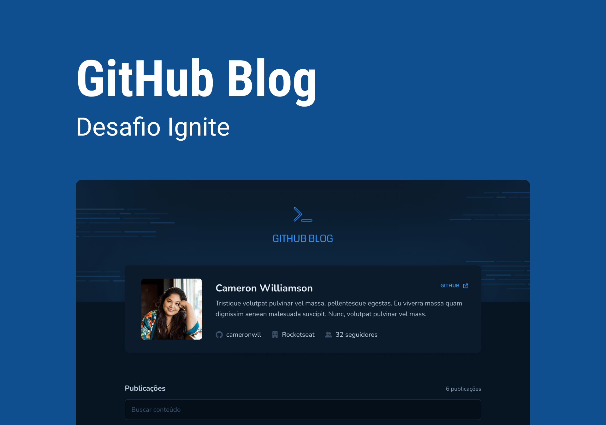

> Ignite - Desafio #3

# GitHub Blog

## Sobre o desafio

O desafio consiste em desenvolver um blog, usando a API do GitHub, que contém as seguintes funcionalidades:

- Exibe um card com nome, bio, avatar, quantidade de followers e link para o perfil do usuário
- Exibe uma lista de posts com título, data de criação, resumo do conteúdo e link para a página da postagem
- Exibe um card com título, data de criação, quantidade comentários e link para a issue
- Exibe uma lista de comentários da issue

## O que foi usado

- React
- TypeScript
- Next.js
- Tailwind
- GitHub API
- Eslint
- Prettier

> O desafio original não inclui Next.js App Router, Tailwind, Eslint e Prettier
>
> Textos das issues e dos comentários gerados pelo ChatGPT
